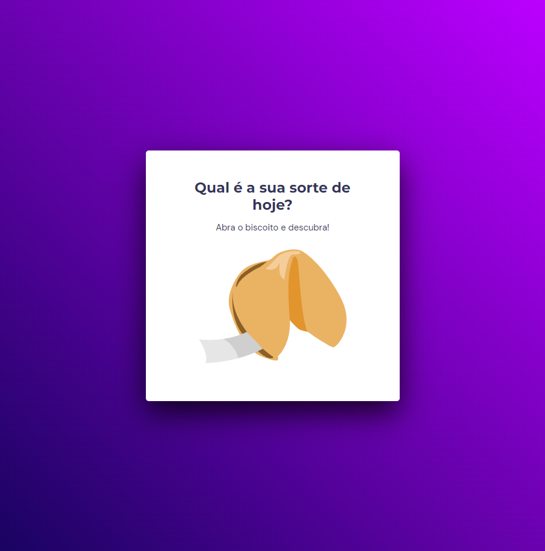

<h1 align="center">Biscoito da Sorte</h1>

[Projeto](#projeto) &nbsp;&nbsp;&nbsp;|&nbsp;&nbsp;&nbsp; [Tecnologias](#tecnologias)
&nbsp;&nbsp;&nbsp;|&nbsp;&nbsp;&nbsp; [Layout](#layout) &nbsp;&nbsp;&nbsp;|&nbsp;&nbsp;&nbsp;
[Licença](#license)

  

 

 
 

## 💻 Projeto 

Projeto desenvolvido durante o 1° módulo do Explorer, curso da Rocketseat, no Stage 5, sendo o
desafio desse módulo, focado para o aprendizado de JavaScript.

Esse projeto consiste em um card com um biscoito, que ao ser clicado, outro card aparece e mostra
uma mensagem da "sorte" de dentro do biscoito.

 
 

## 🚀 Tecnologias 

- HTML
- CSS
- JavaScript

 
 

## 🔖 Layout 

Você pode visualizar o layout do projeto através
[DESSE LINK](<https://www.figma.com/file/BGUj9gvSU2OjfztuyAT41K/Biscoito-da-Sorte-(Community)?type=design&node-id=0%3A1&mode=design&t=hKKgB6mhZ7yCLhfF-1>).
É necessário ter conta no [Figma](https://figma.com) para acessá-lo.

 
 

## 🔒 Licença

Esse projeto está sob a licença MIT.

